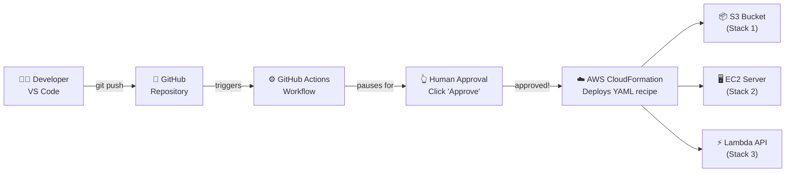

# ☁️ Cloud in Action

> *"Infrastructure as Code: where a text file becomes a server."*

[](https://github.com/YOUR-USERNAME/cloud-in-action/actions/workflows/validate.yml)
[](LICENSE)
[](https://aws.amazon.com/free/)

---

## 🎯 What is this?

**For developers:**
A complete, production-pattern Infrastructure as Code (IaC) repository using AWS
CloudFormation, GitHub Actions with manual approval gates, and VS Code integration.
Three progressively complex stacks — S3 static website → EC2 web server → Lambda API —
each fully commented and independently deployable. Study the security patterns
(least-privilege IAM, SSM over SSH, pinned action SHAs) and adapt them for real workloads.

**For everyone else:**
This repository shows you how "the cloud" actually works — from the inside.
A developer writes a YAML text file. She pushes it to GitHub. A robot checks it for errors,
asks a human to approve, and then tells Amazon to create real servers and websites —
automatically, in under 5 minutes, for free. This repo lets you follow along,
run the same steps yourself, and see it happen live in AWS.

---

## 🗺️ The Big Picture



*Push a YAML file → robot checks it → human approves → server appears in AWS.*
*That's the whole story.*

---

## 🚀 Quick Start — 4 Steps to Live Infrastructure

### Prerequisites
- An [AWS account](https://aws.amazon.com/free/) (free to create)
- A [GitHub account](https://github.com) (free)
- No programming experience required for Steps 1–4

---

### Step 1: Fork this repository

Click the **Fork** button at the top of this page.
This creates your own copy of the repository in your GitHub account.

---

### Step 2: Add AWS credentials to GitHub Secrets

You need to give GitHub permission to create resources in your AWS account.

1. In your AWS account, create an IAM user with these permissions:
   - `CloudFormationFullAccess`
   - `AmazonS3FullAccess`
   - `AmazonEC2FullAccess`
   - `AWSLambda_FullAccess`
   - `IAMFullAccess`
   - `AmazonAPIGatewayAdministrator`
   - `CloudWatchLogsFullAccess`

   > 📖 See [`docs/setup-aws-credentials.md`](docs/setup-aws-credentials.md) for step-by-step screenshots.

2. Create an **Access Key** for that IAM user and copy the key ID and secret.

3. In your GitHub repository: **Settings → Secrets and variables → Actions → New secret**

   Add these three secrets:
   | Name | Value |
   |---|---|
   | `AWS_ACCESS_KEY_ID` | Your IAM access key ID |
   | `AWS_SECRET_ACCESS_KEY` | Your IAM secret access key |
   | `AWS_REGION` | `us-east-1` (or your preferred region) |

---

### Step 3: Set up the Approval Gate

This is the step that makes deployment require a human click — the demo's WOW moment.

1. In your GitHub repository: **Settings → Environments → New environment**
2. Name it exactly: `production`
3. Enable **"Required reviewers"** and add your GitHub username
4. Click **Save protection rules**

Now every deployment must be manually approved before AWS resources are created.

---

### Step 4: Deploy!

**Option A — Automatic deploy:**
Make any small change to a file in `infra/01-storage/` and push to `main`.
The deploy workflow will trigger, pause for your approval, and deploy.

**Option B — Manual trigger:**
Go to **Actions → 🚀 Deploy Stack 1** → **Run workflow** → pick an environment → click **Run**.

Then:
1. Watch the workflow pause at **"Waiting for review"**
2. Click **"Review deployments"** → check the box → **"Approve and deploy"**
3. Watch the steps run in real time
4. Click the **WebsiteURL** in the final step — your website is live! 🎉

---

## 📚 The Three Stacks

| Stack | What It Creates | Deploy Time | Monthly Cost |
|---|---|---|---|
| [Stack 1 — Storage](infra/01-storage/template.yaml) | S3 static website | ~30 seconds | **$0.00** |
| [Stack 2 — Server](infra/02-server/template.yaml) | EC2 web server (VPC + nginx) | ~3-4 minutes | **$0.00** (12 months) |
| [Stack 3 — Serverless](infra/03-serverless/template.yaml) | Lambda + API Gateway | ~1 minute | **$0.00** (forever) |

Each stack is completely independent. Deploy them in any order.

---

## 🎤 Giving the Demo

This repository is designed to be demonstrated live to an audience.

- 📖 **Full presenter guide:** [`DEMO_SCRIPT.md`](DEMO_SCRIPT.md)
- ⏱️ **Estimated time:** 20 minutes
- 👥 **Audience:** anyone curious about cloud, from beginners to developers
- 💡 **No technical background required** to follow the story

The `DEMO_SCRIPT.md` tells you exactly what to say, what to show on screen,
and what questions to ask the audience at each step.

---

## 🔒 Security Notes

Every security decision in this repository is documented inline in the templates.
Here are the highlights:

| Decision | Why |
|---|---|
| No SSH key pair on EC2 | Zero attack surface on port 22. SSM Session Manager provides secure shell access without opening any ports. |
| Least-privilege IAM roles | Lambda can only write logs. EC2 can only use SSM. Nothing more. |
| GitHub Action SHA pins | `actions/checkout@SHA` instead of `@v4` prevents supply chain attacks — a compromised tag won't affect pinned SHAs. |
| Manual approval gate | No deployment reaches AWS without a human reviewing and approving. |
| S3 public access explained | Stack 1 requires public read for a website — the templates explain the security trade-off explicitly. |
| No hardcoded credentials | All secrets in GitHub Secrets — never in code, never in YAML. |

---

## 💡 Learning Path

After exploring this repository, here's where to go next:

**Beginner → Intermediate**
- [ ] [AWS Cloud Practitioner Essentials](https://aws.amazon.com/training/digital/aws-cloud-practitioner-essentials/) (free, ~6 hours)
- [ ] [AWS Cloud Practitioner Certification](https://aws.amazon.com/certification/certified-cloud-practitioner/) ($100, beginner-level)
- [ ] Modify these templates — add another EC2 instance, change the Lambda response

**Intermediate → Advanced**
- [ ] [AWS Solutions Architect Associate](https://aws.amazon.com/certification/certified-solutions-architect-associate/) ($150)
- [ ] Explore [Terraform](https://developer.hashicorp.com/terraform) — multi-cloud IaC
- [ ] Explore [AWS CDK](https://aws.amazon.com/cdk/) — write infrastructure in Python/TypeScript
- [ ] Add a 4th stack with RDS (database) or ECS (containers)

**Concepts to study**
- [ ] AWS Well-Architected Framework (5 pillars)
- [ ] Blue/Green deployments
- [ ] Auto Scaling Groups
- [ ] CloudFormation StackSets (deploy to multiple regions simultaneously)

---

## 💰 Cost

This entire demo costs **$0.00** on AWS Free Tier.

- **S3:** 5 GB + 20K requests/month free
- **EC2 t2.micro:** 750 hours/month free for the first 12 months
- **Lambda:** 1,000,000 requests/month free **forever**
- **API Gateway:** 1,000,000 calls/month free for the first 12 months
- **CloudFormation:** always free
- **VPC, IAM, SSM:** always free

> ⚠️ **Important:** Elastic IP addresses cost $0.005/hour when NOT attached to a running instance.
> Always run the [Teardown workflow](.github/workflows/teardown.yml) after your demo to release the EIP.

---

## 📁 Repository Structure

```
cloud-in-action/
├── infra/
│   ├── 01-storage/
│   │   ├── template.yaml    # S3 static website (MAXIMUM comments)
│   │   └── index.html       # Sample webpage to upload
│   ├── 02-server/
│   │   └── template.yaml    # EC2 + VPC + nginx (MAXIMUM comments)
│   └── 03-serverless/
│       └── template.yaml    # Lambda + API Gateway (MAXIMUM comments)
├── .github/workflows/
│   ├── validate.yml          # Runs on every push — checks templates
│   ├── deploy-stack1.yml     # Deploy S3 website (with approval gate)
│   ├── deploy-stack2.yml     # Deploy EC2 server (with approval gate)
│   ├── deploy-stack3.yml     # Deploy Lambda API (with approval gate)
│   └── teardown.yml          # Delete everything (requires "DELETE" input)
├── .vscode/
│   ├── tasks.json            # One-click deploy/validate/teardown tasks
│   └── launch.json           # VS Code run configurations
├── docs/
│   ├── architecture.md       # Mermaid diagrams + plain-English captions
│   └── aws-concepts.md       # Plain-English glossary of every AWS service
├── DEMO_SCRIPT.md            # 20-minute presenter guide
├── cloud-in-action.code-workspace  # VS Code workspace (recommended extensions)
├── gitignore.txt             # Rename to .gitignore after forking
└── README.md                 # This file
```

---

## 🤝 Contributing

Found a bug? Want to add a 4th stack? PRs welcome!

Please ensure:
- All CloudFormation templates pass `cfn-lint` validation
- New resources include plain-English comments explaining what they do and why
- Security decisions are documented inline

---

*Made with ❤️ for cloud learners everywhere. Deploy boldly. Teardown cleanly.*
