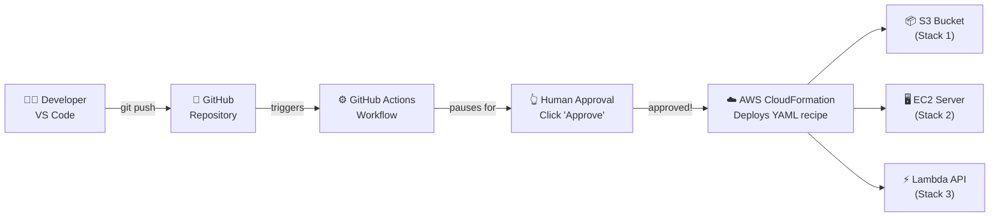
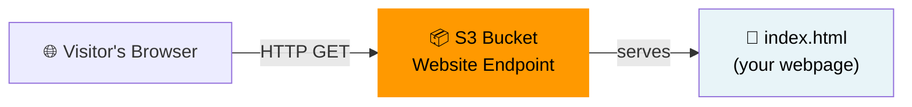
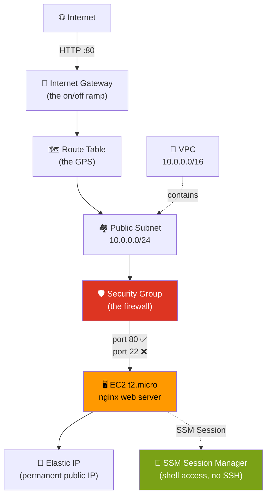
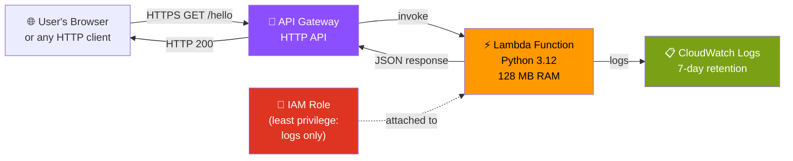

# Architecture Diagrams — cloud-in-action

> These diagrams show what gets created in AWS for each stack.
> GitHub renders Mermaid diagrams natively — no plugins needed.

---

## 🗺️ The Deployment Pipeline

*How code becomes cloud infrastructure — the full journey.*

**Plain English:** A developer writes a YAML file describing what infrastructure
she needs. She pushes it to GitHub. GitHub runs a robot that checks the YAML,
asks a human to approve, then tells AWS to build the infrastructure automatically.
The whole process takes less than 5 minutes — no manual AWS Console clicking required.

---

## Stack 1: "Hello, Cloud Storage" — S3 Static Website

*What gets created when you deploy `infra/01-storage/template.yaml`*

**Plain English:** Amazon S3 is like a USB drive in the cloud that never gets
lost. We configure it to serve a website — meaning anyone with the URL can view
the HTML file stored in the bucket. No web server, no EC2, no maintenance.
Amazon handles everything.

**Resources created:**
| Resource | Type | Purpose |
|---|---|---|
| `WebsiteBucket` | `AWS::S3::Bucket` | Stores your HTML files |
| `WebsiteBucketPolicy` | `AWS::S3::BucketPolicy` | Allows public read access |

**FREE TIER:** 5 GB storage + 20,000 GET requests/month = **$0.00**

---

## Stack 2: "Hello, Cloud Server" — EC2 Web Server

*What gets created when you deploy `infra/02-server/template.yaml`*

**Plain English:** AWS builds a complete private network (VPC) from scratch,
puts a virtual computer (EC2) inside it, and connects it to the internet
through a gateway. A firewall (Security Group) allows website traffic but
blocks SSH. You can still access the server's command line through AWS's
secure tunnel (SSM) — no SSH key needed.

**Resources created:**
| Resource | Type | Purpose |
|---|---|---|
| `VPC` | `AWS::EC2::VPC` | Your private network space |
| `PublicSubnet` | `AWS::EC2::Subnet` | A slice of the network |
| `InternetGateway` | `AWS::EC2::InternetGateway` | On/off ramp to internet |
| `PublicRouteTable` | `AWS::EC2::RouteTable` | Traffic routing rules |
| `WebServerSecurityGroup` | `AWS::EC2::SecurityGroup` | Firewall rules |
| `WebServerRole` | `AWS::IAM::Role` | EC2 permissions |
| `WebServer` | `AWS::EC2::Instance` | The virtual server (t2.micro) |
| `ElasticIP` | `AWS::EC2::EIP` | Permanent public IP address |

**FREE TIER:** t2.micro = **750 hours/month FREE** for 12 months = **$0.00**

---

## Stack 3: "Hello, Serverless" — Lambda + API Gateway

*What gets created when you deploy `infra/03-serverless/template.yaml`*

**Plain English:** When someone visits the API URL, API Gateway receives the
request and passes it to the Lambda function. Lambda runs the Python code for
a few milliseconds, returns a JSON response, and stops. There is no server
running between requests — nothing to pay for, nothing to maintain.

**Resources created:**
| Resource | Type | Purpose |
|---|---|---|
| `LambdaLogGroup` | `AWS::Logs::LogGroup` | Stores function logs (7 days) |
| `LambdaExecutionRole` | `AWS::IAM::Role` | Least-privilege permissions |
| `HelloLambda` | `AWS::Lambda::Function` | The serverless function |
| `HelloApi` | `AWS::ApiGatewayV2::Api` | HTTPS API endpoint |
| `LambdaIntegration` | `AWS::ApiGatewayV2::Integration` | Connects API → Lambda |
| `HelloRoute` | `AWS::ApiGatewayV2::Route` | GET /hello routing rule |
| `ApiStage` | `AWS::ApiGatewayV2::Stage` | API deployment stage |
| `LambdaInvokePermission` | `AWS::Lambda::Permission` | Allows API → Lambda calls |

**FREE TIER:** 1,000,000 Lambda requests/month **FREE FOREVER** = **$0.00**

---

## Cost Summary

| Stack | Resources | Deploy Time | Monthly Cost (Free Tier) |
|---|---|---|---|
| Stack 1 — S3 | Bucket + Policy | ~30 sec | **$0.00** |
| Stack 2 — EC2 | 8 resources | ~3-4 min | **$0.00** (first 12 months) |
| Stack 3 — Lambda | 8 resources | ~1 min | **$0.00** (forever) |
| **TOTAL** | **18 resources** | **~5 min** | **$0.00** |

> **Important:** Elastic IP costs $0.005/hr when NOT attached to a running instance.
> Always run the **Teardown** workflow after your demo to release the EIP.
